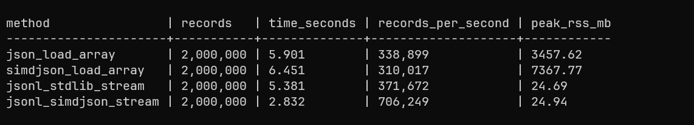

# JSON Ingestion Notes

Small benchmark comparing Python `json` and `simdjson` for large JSON ingestion.

The point is not to prove one parser is always better.

The point is to show how file shape and processing model affect memory usage.

Write-up: [Large JSON in Python: Parser Speed Is Not the Whole Problem](https://jadhav.dev/blog/large-json-python/parser-speed-is-not-the-whole-problem)

## Published Results

Reference run with 2,000,000 synthetic records:



The JSONL streaming methods stayed around 25 MB peak RSS.

The full JSON array methods used multiple GB because they materialized the parsed data before processing could continue.

Raw outputs are available in [`results/benchmark-output.txt`](results/benchmark-output.txt) and [`results/benchmark.csv`](results/benchmark.csv).

## Setup

```bash
uv sync
```

## Generate Data

```bash
uv run python make_dataset.py --records 250000 --out data
```

## Run Benchmark

```bash
uv run python bench_json.py all --array data/large_array.json --jsonl data/large_events.jsonl --out results/benchmark.csv
```

Run one parser method:

```bash
uv run python bench_json.py one --method jsonl_stdlib_stream --path data/large_events.jsonl
```
